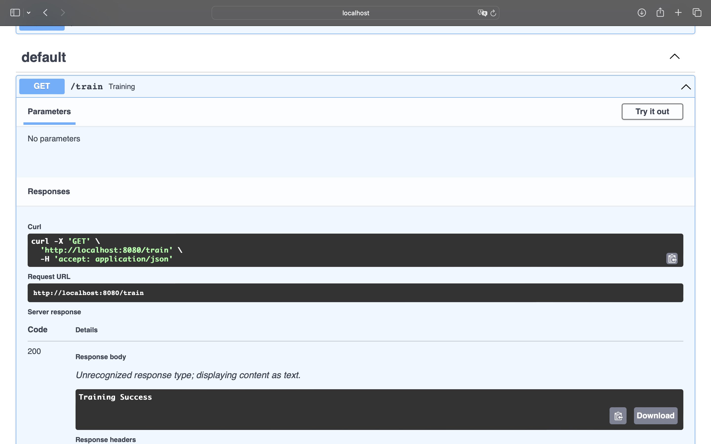

# Text Summariser

This project is a Text summariser application that uses Hugging Face Transformers fine-tuned on the SAMSum dataset. The summariser takes input text and provides a concise summary. The application includes APIs for training the model and generating summaries.

## Installation

To get started with the project, follow these steps:

1. Clone the repository:
    ```sh
    git clone https://github.com/TANMAY-WANI/Text-summariser.git
    cd Text-summariser
    ```

2. Install the required dependencies:
    ```sh
    pip install -r requirements.txt
    pip install --upgrade accelerate
    pip uninstall -y transformers accelerate
    pip install transformers accelerate
    ```

## Running the Application

1. Start the application:
    ```sh
    python3 app.py
    ```

## API Endpoints

### Train the Model

Before using the summarization functionality, you need to train the model. Use the `/train` API to train the model.

- **Endpoint:** `/train`
- **Method:** GET
- **Description:** Trains the model on the SAMSum dataset.

### Generate Summary

After training the model, use the `/predict` API to summarize any text.

- **Endpoint:** `/predict`
- **Method:** POST
- **Description:** Provides a summary of the input text.
- **Request Body:**
    ```json
    {
        "text": "Your input text to be summarized."
    }
    ```

## Screenshots

### Application Startup


### Training the Model


### Generating Summary


## Acknowledgments

- Hugging Face Transformers: [https://github.com/huggingface/transformers](https://github.com/huggingface/transformers)
- SAMSum Dataset: [https://huggingface.co/datasets/samsum](https://huggingface.co/datasets/samsum)
- Accelerate: [https://github.com/huggingface/accelerate](https://github.com/huggingface/accelerate)

Feel free to open issues or contribute to the project by submitting pull requests.

Happy Summarizing!
